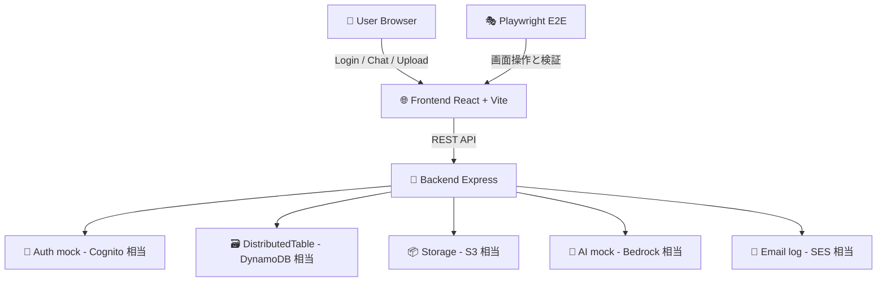
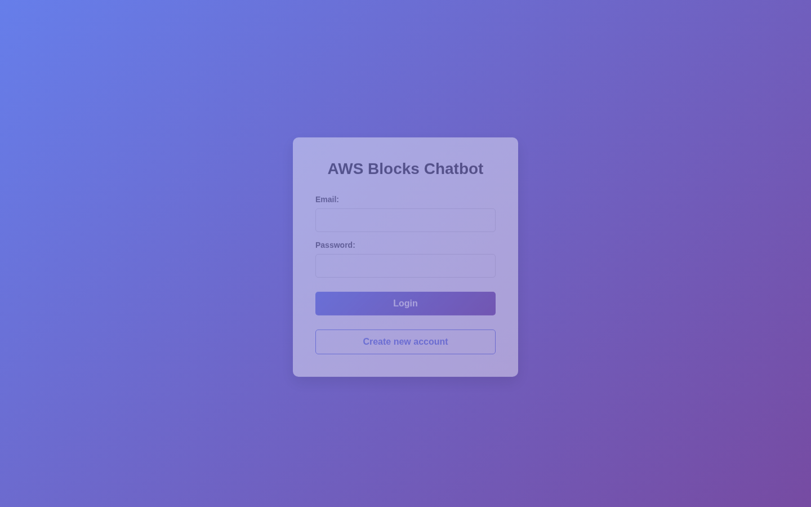
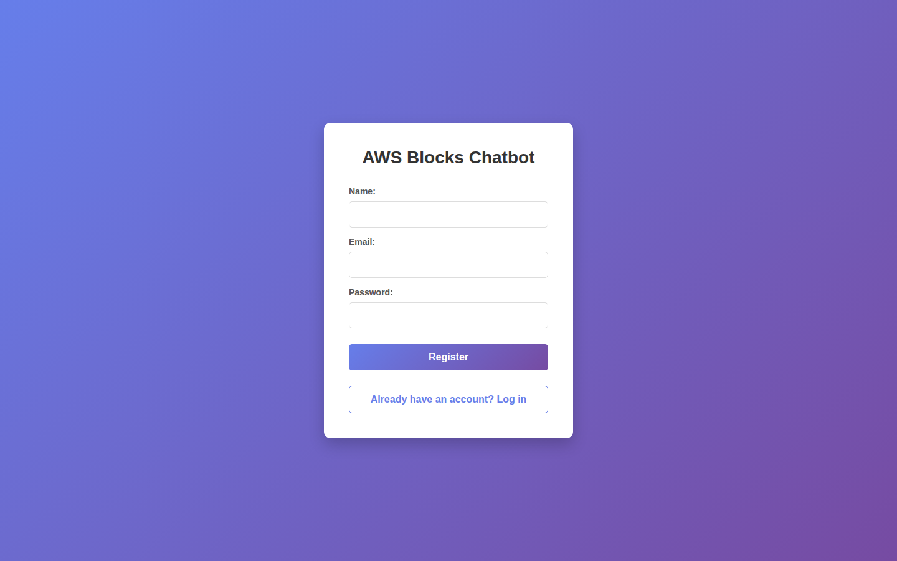
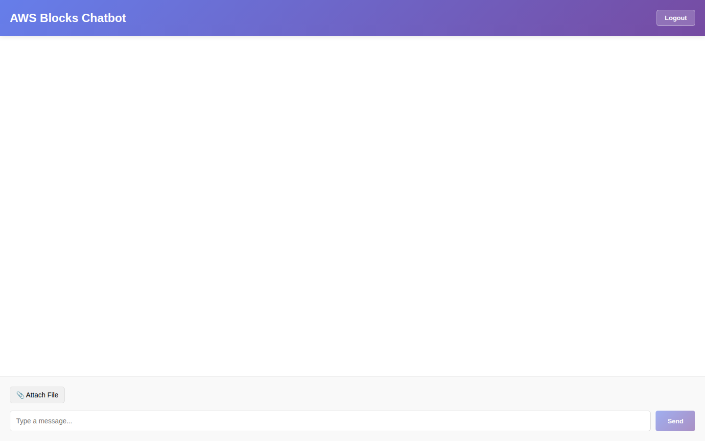
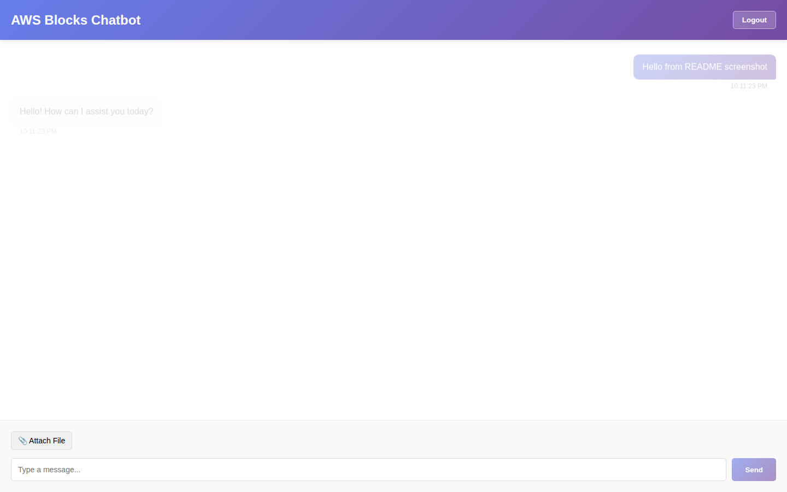
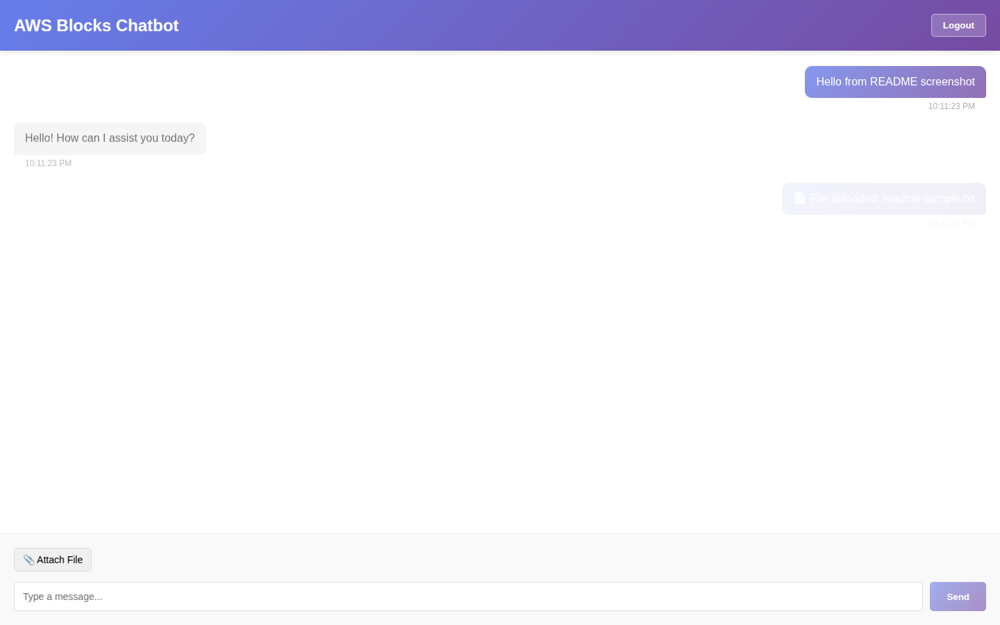

# test_a_blocks

AWS Blocks を使ったチャットアプリのローカルエミュレーション + E2E テスト検証プロジェクトです。

## これは何をするプロジェクト？

本番 AWS を直接使わずに、ローカルで AWS っぽい挙動を再現しながらアプリを開発し、Playwright で E2E を回します。

- 🧪 E2E で画面操作を自動検証
- ☁️ AWS サービス相当の機能をローカルでエミュレート
- 🔁 同じ API 設計のまま本番構成へ寄せやすい

## 🆕 最新改善内容（このバージョン）

### E2E環境での aws-blocks 自動切り替え

本プロジェクトはE2E（End-to-End）テスト用プロジェクトです。環境変数 `USE_AWS_BLOCKS_EMULATION` で、AWS Blocks のエミュレーション モードを制御できるようになりました。

```bash
# E2E テスト実行時は自動的に aws-blocks エミュレーションが有効になります
npm run test:e2e

# または手動で環境変数を指定
USE_AWS_BLOCKS_EMULATION=true npm run test:e2e

# 本番AWS環境を使う場合（デフォルト）
USE_AWS_BLOCKS_EMULATION=false npm run start:backend:local
```

### 実装の詳細化

各 AWS Blocks クラスに詳細な日本語コメントを追加し、実装内容を明確にしました：

- **bb-auth.ts**: Cognito モック実装に詳細なコメント追加
- **bb-distributed-table.ts**: DynamoDB モック実装に API マッピングコメント追加
- **bb-storage.ts**: S3 モック実装に動作説明コメント追加
- **bb-ai.ts**: Bedrock モック実装にモデル選択情報追加

### E2E テストの拡張

新しい E2E テストとコメント追加：

- **chat-persistence.spec.ts**: メッセージの永続性、複数メッセージ処理、エラーハンドリングを検証
- **既存テストへの日本語コメント**: auth.spec.ts, chat.spec.ts, file-upload.spec.ts, ai-response.spec.ts に日本語コメント追加

### Backend ログの充実

Backend 起動時の情報表示を改善：

```
Blocks Mode: ローカルエミュレーション
```

Health Check エンドポイントでも Blocks Mode が確認可能：

```bash
curl http://localhost:3001/health
# {
#   "status": "ok",
#   "environment": "test",
#   "blocksMode": "ローカルエミュレーション",
#   "isEmulation": true,
#   "timestamp": "..."
# }
```

## まず全体像をつかむ



## 技術スタック

| レイヤー | 技術 | 役割 |
|---|---|---|
| Frontend | React 18 + Vite | ログイン画面、チャット画面、ファイルアップロード UI |
| Backend | Express + TypeScript | API 提供、ローカルエミュレーション統合 |
| E2E | Playwright | UI の自動テスト |
| CI | GitHub Actions | テスト自動実行とレポート保存 |

## AWS サービス利用とエミュレーション早見表

### 1) どの AWS サービスを何に使っているか

| AWS サービス | このアプリでの用途 | 関連 API / 画面 |
|---|---|---|
| Amazon Cognito | ユーザー登録・ログイン・トークン検証 | `/api/auth/*` / Login 画面 |
| Amazon DynamoDB | チャット、メッセージ、ユーザー、セッション情報の保存 | `/api/chats`, `/api/messages` |
| Amazon S3 | チャットへのファイル添付保存 | `/api/files/upload` / Chat 画面 |
| Amazon Bedrock | ユーザー投稿に対する AI 応答 | `/api/ai/generate` / Chat 画面 |
| Amazon SES | 通知メール送信 | `/api/email/*` |
| AWS Lambda | API ハンドラや非同期処理の実行イメージ | Express ルート処理で代替 |

### 2) どうエミュレートしているか（実装ベース）

| AWS サービス | ローカルでのエミュレート方式 | 実装ポイント |
|---|---|---|
| Cognito | `Auth` Block (`signUp/signIn/verifyToken/signOut`) を利用 | `backend/src/routes/auth.ts`, `backend/src/aws-blocks/bb-auth.ts` |
| DynamoDB | `Map` ベースのインメモリテーブル (`put/get/query/delete`) | `backend/src/aws-blocks/bb-distributed-table.ts` |
| S3 | `Storage` Block (`put/get/delete/list`) でファイル保持 | `backend/src/aws-blocks/bb-storage.ts`, `backend/src/routes/files.ts` |
| Bedrock | `AI` Block (`invoke/invokeStreaming`) を利用 | `backend/src/routes/ai.ts`, `backend/src/aws-blocks/bb-ai.ts` |
| SES | 実送信せずコンソールログ出力 | `backend/src/routes/email.ts` |
| Lambda | Express ルーティングで処理実行 | `backend/src/index.ts` + 各 route |

## 各エミュレートのコード例（公式ドキュメントの考え方に沿った書き方）

AWS Blocks の説明に合わせて、ここでは次の順で例を示します。

1. Block を宣言する
2. アプリコードから Block を呼び出す

### 🧱 Block 宣言例（本リポジトリ）

```ts
// backend/src/blocks/index.ts

// 環境変数で aws-blocks エミュレーションの使用を制御
// E2E環境: USE_AWS_BLOCKS_EMULATION=true
// 本番環境: USE_AWS_BLOCKS_EMULATION=false
const USE_AWS_BLOCKS_EMULATION = process.env.USE_AWS_BLOCKS_EMULATION !== 'false';

if (USE_AWS_BLOCKS_EMULATION) {
  console.log('[AWS Blocks] Using LOCAL EMULATION mode');
} else {
  console.log('[AWS Blocks] Using PRODUCTION AWS SERVICES mode');
}

// チャット履歴とメッセージを管理するテーブル
// E2E環境: メモリ上のMapでエミュレート
// 本番環境: DynamoDB に接続
export const chatTable = new DistributedTable({
    name: 'ChatMessages',
    partitionKey: { name: 'chatId', type: 'string' },
    sortKey: { name: 'timestamp', type: 'number' },
});

// ファイルアップロード用ストレージ（S3 相当）
// E2E環境: メモリ上のMapでエミュレート
// 本番環境: Amazon S3 に接続
export const fileStorage = new Storage({ name: 'ChatFiles' });

// 認証機能（Cognito 相当）
// E2E環境: モック実装で固定トークン生成
// 本番環境: Amazon Cognito に接続
export const auth = new Auth({ name: 'ChatBotAuth' });

// AI/Bedrock 相当（LLM レスポンス生成）
// E2E環境: モック応答を返す
// 本番環境: Amazon Bedrock に接続して実際のLLMモデルを使用
export const aiModel = new AI({ 
  name: 'ChatBotAI', 
  modelType: 'text-generation',
  temperature: 0.7,
  maxTokens: 512 
});

// エミュレーション状態をエクスポート（デバッグ用）
export const getBlocksMode = () => ({
  isEmulation: USE_AWS_BLOCKS_EMULATION,
  description: USE_AWS_BLOCKS_EMULATION ? 'ローカルエミュレーション' : '本番AWS環境',
});
```

### 🔐 Cognito 相当（Auth）利用例

```ts
// backend/src/aws-blocks/bb-auth.ts

/**
 * E2E環境: タイムスタンプベースのトークンを生成
 * 本番環境では Cognito が JWT トークンを返す
 * 
 * 本番環境での実装例:
 * const response = await cognitoClient.initiateAuth({
 *   ClientId: this.clientId,
 *   AuthFlow: 'USER_PASSWORD_AUTH',
 *   AuthParameters: {
 *     USERNAME: email,
 *     PASSWORD: password
 *   }
 * });
 */
async signIn(email: string, password: string): Promise<{ token: string }> {
    return { token: `token-${Date.now()}` };
}

// backend/src/routes/auth.ts

// Auth Block を経由して認証（Cognito 相当）
const { token } = await auth.signIn(email, password);
const verified = await auth.verifyToken(token);
```

### 🗃️ DynamoDB 相当（DistributedTable）利用例

```ts
// backend/src/aws-blocks/bb-distributed-table.ts

/**
 * パーティションキーで条件に合うアイテム群を検索
 * 
 * E2E環境: メモリ内Mapから条件に合うアイテムをフィルタ
 * 本番環境では DynamoDB の Query API を呼び出す:
 * const result = await dynamoDbClient.query({
 *   TableName: this.name,
 *   KeyConditionExpression: 'pk = :pk',
 *   ExpressionAttributeValues: {
 *     ':pk': { S: partitionKeyValue }
 *   }
 * });
 */
async query(partitionKeyValue: string): Promise<any[]> {
    const prefix = partitionKeyValue + '#';
    return Array.from(this.data.values()).filter(item => {
        const key = this.getKey(item);
        return key.startsWith(prefix) || key === partitionKeyValue;
    });
}

// backend/src/routes/messages.ts

// テーブルにアイテムを追加
await chatTable.put({
    chatId,
    timestamp,
    messageId,
    userId,
    content,
    role,
});

// パーティションキーで検索
const messages = await chatTable.query(chatId);
```

### 📦 S3 相当（Storage）利用例

```ts
// backend/src/aws-blocks/bb-storage.ts

/**
 * ストレージにオブジェクトを保存する
 * 
 * E2E環境: メモリ内のMapにデータを保存
 * 本番環境では S3 の PutObject API を呼び出す:
 * await s3Client.putObject({
 *   Bucket: this.bucketName,
 *   Key: key,
 *   Body: data
 * });
 */
async put(key: string, data: Buffer | string): Promise<void> {
    const buffer = typeof data === 'string' ? Buffer.from(data) : data;
    this.files.set(key, buffer);
}

// backend/src/routes/files.ts

// ファイルをストレージに保存
await fileStorage.put(fileKey, fileContent);

// ストレージからファイルを取得
const content = await fileStorage.get(meta.fileKey);
```

### 🤖 Bedrock 相当（AI）利用例

```ts
// backend/src/aws-blocks/bb-ai.ts

/**
 * E2E環境: モック応答を返す
 * 本番環境では Amazon Bedrock に接続:
 * const response = await bedrockClient.invokeModel({
 *   modelId: this.modelId,
 *   body: JSON.stringify({ prompt, ... })
 * });
 */
async invoke(prompt: string): Promise<string> {
    return `Mock AI response to: "${prompt}"`;
}

// backend/src/routes/ai.ts

// AI Block を経由して応答生成（Bedrock 相当）
const response = await aiModel.invoke(lastUserMessage);

// ストリーミング応答
const chunks = await aiModel.invokeStreaming(lastUserMessage);
for await (const chunk of chunks) {
  res.write(`data: ${JSON.stringify({ chunk })}\n\n`);
}
```

### 📧 SES 相当（メール通知）利用例

```ts
// backend/src/routes/email.ts

// E2E環境: コンソールログに出力
// 本番環境では Amazon SES でメール送信:
// await sesClient.sendEmail({
//   Source: fromAddress,
//   Destination: { ToAddresses: [to] },
//   Message: { Subject: { Data: subject }, Body: { Html: { Data: body } } }
// });
console.log(`
[EMAIL NOTIFICATION]
ID: ${emailId}
To: ${to}
Subject: ${subject}
Body: ${body}
`);
```

### ⚙️ Lambda 相当（実行モデル）利用例

```ts
// backend/src/index.ts

// Express ルーティングで Lambda 相当の処理を実装
app.use('/api/auth', authRouter);      // 認証関連の処理
app.use('/api/chats', chatsRouter);    // チャット管理
app.use('/api/messages', messagesRouter); // メッセージ処理
app.use('/api/files', filesRouter);    // ファイル処理
app.use('/api/ai', aiRouter);          // AI応答生成
app.use('/api/email', emailRouter);    // メール通知
```

### ✅ 実装整合性チェック結果（README更新時点）

| 項目 | 判定 | 内容 |
|---|---|---|
| Auth Block (`auth`) の利用 | ✅ 一致 | `/api/auth/register/login/logout/verify` から `signUp/signIn/signOut/verifyToken` を呼び出し |
| Storage Block (`fileStorage`) の利用 | ✅ 一致 | `/api/files/upload/download/delete/chat` で `put/get/delete` とメタデータ管理を実行 |
| AI Block (`aiModel`) の利用 | ✅ 一致 | `/api/ai/generate` で `invoke`、`/api/ai/stream` で `invokeStreaming` を使用 |
| DistributedTable (`chatTable`) の利用 | ✅ 一致 | `messages` や `chats` の一部で `put/query/delete` を実装 |
| E2E環境切り替え | ✅ 実装完了 | `USE_AWS_BLOCKS_EMULATION` 環境変数で自動制御 |

## Workflow 実行後の GitHub Pages URL

⚠️ **重要な注意事項**

E2E workflow が実行されると、GitHub Pages のルートディレクトリが上書きされます。このリポジトリで GitHub Pages に他のコンテンツを保存している場合は、別の方法での公開を検討してください。

E2E workflow が `main` で完了すると、Playwright レポートは GitHub Pages に公開されます。
### URL 形式

```text
https://<owner>.github.io/<repo>/
```

### このリポジトリの例

```text
https://cocomomojo.github.io/test_a_blocks/
```

補足:

- Pull Request コメントにも同URLが自動投稿されます。
- GitHub Actions の Summary にも同URLが出力されます。
- **重要**: 各ワークフロー実行で最新のテストレポートが同じURLに上書きされます。
- **変更履歴**: 以前のバージョンでは run 番号に基づいたURLが使用されていました（例: `reports/${{ github.run_number }}/`）。このバージョンでは、固定URLで常に最新のレポートにアクセスできるようになりました。
- **過去のテストレポートを保持する必要がある場合**: ワークフロー設定で `destination_dir: reports/${{ github.run_number }}`、`keep_files: true` に変更してください。

### レポートURLを開く（CLI）

```bash
# 以下のURLを自分のリポジトリに合わせて変更してください
URL="https://cocomomojo.github.io/test_a_blocks/"
echo "$URL"

# macOS
open "$URL"

# Linux
xdg-open "$URL"

# Windows (PowerShell)
start "$URL"
```

補足:

- URLだけ確認したい場合は `echo "$URL"` まででOKです。
- 自動でブラウザを開きたい場合は環境に応じて上記コマンドを使用してください。

## スクリーンショットで見る機能とE2E検証

以下の画像は Playwright を使ってローカル起動中の画面から取得しています。

### ログイン画面



| 画面で見えるもの | ここでエミュレートされる AWS 相当 | E2E で検証していること |
|---|---|---|
| Email/Password 入力 + Login ボタン | Cognito 相当の認証フロー | ログイン表示、必須入力、ログイン成功、localStorage 保存、ログアウト |

**関連 E2E テスト:**
- `e2e/auth.spec.ts` - ログインページ表示、入力検証、ログイン機能

### 登録画面（切り替え）



| 画面で見えるもの | ここでエミュレートされる AWS 相当 | E2E で検証していること |
|---|---|---|
| Name 項目の表示切り替え | Cognito 相当の登録処理 | Login/Register の切替、登録後にログイン画面へ戻ること |

**関連 E2E テスト:**
- `e2e/auth.spec.ts` - 登録フォームの表示、バリデーション

### チャット画面（初期表示）



| 画面で見えるもの | ここでエミュレートされる AWS 相当 | E2E で検証していること |
|---|---|---|
| メッセージ欄、送信欄、Logout | DynamoDB 相当のチャット/メッセージ管理 | チャット画面描画、入力欄表示、複数メッセージ処理、時刻表示 |

**関連 E2E テスト:**
- `e2e/chat.spec.ts` - チャットページ表示、メッセージ表示
- `e2e/chat-persistence.spec.ts` - メッセージ永続性、複数メッセージ管理

### チャット + AI応答



| 画面で見えるもの | ここでエミュレートされる AWS 相当 | E2E で検証していること |
|---|---|---|
| ユーザーメッセージとAI返信 | Bedrock 相当の応答生成 | 送信後に assistant メッセージが表示されること、応答が空でないこと、メッセージロール判定 |

**関連 E2E テスト:**
- `e2e/ai-response.spec.ts` - AI応答生成、複数メッセージコンテキスト
- `e2e/chat.spec.ts` - メッセージ送受信フロー

### ファイル添付後の画面



| 画面で見えるもの | ここでエミュレートされる AWS 相当 | E2E で検証していること |
|---|---|---|
| `File uploaded` メッセージ | S3 相当の保存処理 | 添付ボタン表示、アップロード成功表示、複数ファイル/拡張子対応、ファイルメタデータ保存 |

**関連 E2E テスト:**
- `e2e/file-upload.spec.ts` - ファイルアップロード、複数ファイル対応、異なる拡張子対応

## E2E テスト仕様マップ

| テストファイル | 主な対象 | 代表的な確認項目 | テスト数 |
|---|---|---|---|
| `e2e/auth.spec.ts` | 認証 | ログイン表示、登録切替、ログイン成功、トークン保存、ログアウト | 複数 |
| `e2e/chat.spec.ts` | チャット基本機能 | メッセージ送受信、複数送信、時刻表示、送信中の状態 | 複数 |
| `e2e/chat-persistence.spec.ts` | メッセージ永続性 | 複数メッセージ管理、ユーザー/AIメッセージ区別、入力フィールドクリア、エラーハンドリング | 8個以上 |
| `e2e/file-upload.spec.ts` | ファイル添付 | 添付 UI、アップロード成功、複数/複数形式対応 | 複数 |
| `e2e/ai-response.spec.ts` | AI 応答 | 応答生成、履歴継続、あいさつ/質問への返答、ロール判定 | 複数 |

## セットアップ

### 前提

- Node.js 18 以上
- npm 9 以上

### インストール

```bash
npm install
cd backend && npm install
cd ../frontend && npm install
cd .. && npx playwright install
```

## 実行手順

### 開発起動（同時実行）

```bash
# Backend + Frontend を同時起動
# 自動的に USE_AWS_BLOCKS_EMULATION=true が適用されます
npm run dev:all
```

### E2E テスト実行

```bash
# E2E テストを実行（Playwright）
# 自動的に aws-blocks エミュレーションモードで起動
npm run test:e2e

# UI モードで対話的にテストを確認
npm run test:e2e:ui

# デバッグモードで実行
npm run test:e2e:debug
```

### Backend のみ起動（本番 AWS 環境向け）

```bash
# ローカルエミュレーションモード
USE_AWS_BLOCKS_EMULATION=true npm run start:backend:local

# 本番 AWS 環境モード（AWS SDK が必要）
USE_AWS_BLOCKS_EMULATION=false npm run start:backend:local
```

### Frontend のみ起動

```bash
cd frontend
npm run dev
```

## ビルド

```bash
npm run build
```

### Backend ビルド

```bash
cd backend && npm run build
```

### Frontend ビルド

```bash
cd frontend && vite build
```

## 型チェック

```bash
npm run type-check
```

## トラブルシューティング

### E2E テストが失敗する場合

1. 既存サーバーが起動していないか確認
   ```bash
   lsof -i :3000 :3001  # macOS/Linux
   netstat -ano | findstr :3000 :3001  # Windows
   ```

2. ポートをクリア
   ```bash
   kill -9 <PID>  # macOS/Linux
   taskkill /PID <PID> /F  # Windows
   ```

3. 再度テスト実行
   ```bash
   npm run test:e2e
   ```

### Backend が起動しない場合

1. Node.js バージョン確認
   ```bash
   node --version  # 18 以上を確認
   ```

2. 依存関係を再インストール
   ```bash
   cd backend && rm -rf node_modules package-lock.json
   npm install
   cd ..
   ```

3. TypeScript エラーをチェック
   ```bash
   cd backend && npm run type-check
   ```

## ライセンス

MIT
