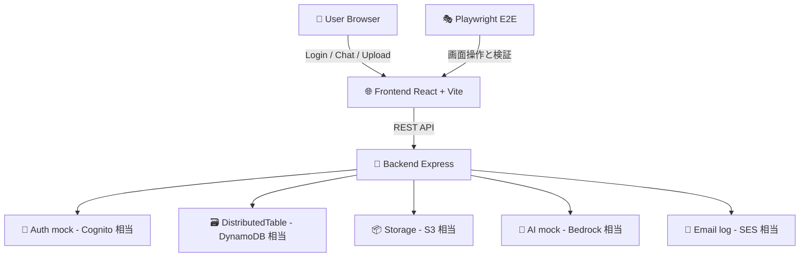

# test_a_blocks

AWS Blocks を使ったチャットアプリのローカルエミュレーション + E2E テスト検証プロジェクトです。

## これは何をするプロジェクト？

本番 AWS を直接使わずに、ローカルで AWS っぽい挙動を再現しながらアプリを開発し、Playwright で E2E を回します。

- 🧪 E2E で画面操作を自動検証
- ☁️ AWS サービス相当の機能をローカルでエミュレート
- 🔁 同じ API 設計のまま本番構成へ寄せやすい

## まず全体像をつかむ



## 技術スタック

| レイヤー | 技術 | 役割 |
|---|---|---|
| Frontend | React 18 + Vite | ログイン画面、チャット画面、ファイルアップロード UI |
| Backend | Express + TypeScript | API 提供、ローカルエミュレーション統合 |
| E2E | Playwright | UI の自動テスト |
| CI | GitHub Actions | テスト自動実行とレポート保存 |

## AWS サービス利用とエミュレーション早見表

### 1) どの AWS サービスを何に使っているか

| AWS サービス | このアプリでの用途 | 関連 API / 画面 |
|---|---|---|
| Amazon Cognito | ユーザー登録・ログイン・トークン検証 | `/api/auth/*` / Login 画面 |
| Amazon DynamoDB | チャット、メッセージ、ユーザー、セッション情報の保存 | `/api/chats`, `/api/messages` |
| Amazon S3 | チャットへのファイル添付保存 | `/api/files/upload` / Chat 画面 |
| Amazon Bedrock | ユーザー投稿に対する AI 応答 | `/api/ai/generate` / Chat 画面 |
| Amazon SES | 通知メール送信 | `/api/email/*` |
| AWS Lambda | API ハンドラや非同期処理の実行イメージ | Express ルート処理で代替 |

### 2) どうエミュレートしているか（実装ベース）

| AWS サービス | ローカルでのエミュレート方式 | 実装ポイント |
|---|---|---|
| Cognito | `Auth` Block (`signUp/signIn/verifyToken/signOut`) を利用 | `backend/src/routes/auth.ts`, `backend/src/aws-blocks/bb-auth.ts` |
| DynamoDB | `Map` ベースのインメモリテーブル (`put/get/query/delete`) | `backend/src/aws-blocks/bb-distributed-table.ts` |
| S3 | `Storage` Block (`put/get/delete/list`) でファイル保持 | `backend/src/aws-blocks/bb-storage.ts`, `backend/src/routes/files.ts` |
| Bedrock | `AI` Block (`invoke/invokeStreaming`) を利用 | `backend/src/routes/ai.ts`, `backend/src/aws-blocks/bb-ai.ts` |
| SES | 実送信せずコンソールログ出力 | `backend/src/routes/email.ts` |
| Lambda | Express ルーティングで処理実行 | `backend/src/index.ts` + 各 route |

## 各エミュレートのコード例（公式ドキュメントの考え方に沿った書き方）

AWS Blocks の説明に合わせて、ここでは次の順で例を示します。

1. Block を宣言する
2. アプリコードから Block を呼び出す

### 🧱 Block 宣言例（本リポジトリ）

```ts
// backend/src/blocks/index.ts
import { DistributedTable } from '../aws-blocks/bb-distributed-table';
import { Storage } from '../aws-blocks/bb-storage';
import { Auth } from '../aws-blocks/bb-auth';
import { AI } from '../aws-blocks/bb-ai';

export const chatTable = new DistributedTable({
    name: 'ChatMessages',
    partitionKey: { name: 'chatId', type: 'string' },
    sortKey: { name: 'timestamp', type: 'number' },
});

export const fileStorage = new Storage({ name: 'ChatFiles' });
export const auth = new Auth({ name: 'ChatBotAuth' });
export const aiModel = new AI({ name: 'ChatBotAI', modelType: 'text-generation' });
```

### 🔐 Cognito 相当（Auth）利用例

```ts
// backend/src/aws-blocks/bb-auth.ts
async signIn(email: string, password: string): Promise<{ token: string }> {
    return { token: `token-${Date.now()}` };
}

// backend/src/routes/auth.ts
const { token } = await auth.signIn(email, password);
const verified = await auth.verifyToken(token);
```

### 🗃️ DynamoDB 相当（DistributedTable）利用例

```ts
// backend/src/routes/messages.ts
await chatTable.put({
    chatId,
    timestamp,
    messageId,
    userId,
    content,
    role,
});

// backend/src/aws-blocks/bb-distributed-table.ts
async query(partitionKeyValue: string): Promise<any[]> {
    const prefix = partitionKeyValue + '#';
    return Array.from(this.data.values()).filter((item) => {
        const key = this.getKey(item);
        return key.startsWith(prefix) || key === partitionKeyValue;
    });
}
```

### 📦 S3 相当（Storage）利用例

```ts
// backend/src/aws-blocks/bb-storage.ts
async put(key: string, data: Buffer | string): Promise<void> {
    const buffer = typeof data === 'string' ? Buffer.from(data) : data;
    this.files.set(key, buffer);
}

async get(key: string): Promise<Buffer | null> {
    return this.files.get(key) || null;
}

// backend/src/routes/files.ts
await fileStorage.put(fileKey, fileContent);
const content = await fileStorage.get(meta.fileKey);
```

### 🤖 Bedrock 相当（AI）利用例

```ts
// backend/src/aws-blocks/bb-ai.ts
async invoke(prompt: string): Promise<string> {
    return `Mock AI response to: "${prompt}"`;
}

// backend/src/routes/ai.ts
const response = await aiModel.invoke(lastUserMessage);
const chunks = await aiModel.invokeStreaming(lastUserMessage);
```

### 📧 SES 相当（メール通知）利用例

```ts
// backend/src/routes/email.ts
console.log(`
[EMAIL NOTIFICATION]
ID: ${emailId}
To: ${to}
Subject: ${subject}
Body: ${body}
`);
```

### ⚙️ Lambda 相当（実行モデル）利用例

```ts
// backend/src/index.ts
app.use('/api/auth', authRouter);
app.use('/api/chats', chatsRouter);
app.use('/api/messages', messagesRouter);
app.use('/api/files', filesRouter);
app.use('/api/ai', aiRouter);
app.use('/api/email', emailRouter);
```

### ✅ 実装整合性チェック結果（README更新時点）

| 項目 | 判定 | 内容 |
|---|---|---|
| Auth Block (`auth`) の利用 | ✅ 一致 | `/api/auth/register/login/logout/verify` から `signUp/signIn/signOut/verifyToken` を呼び出し |
| Storage Block (`fileStorage`) の利用 | ✅ 一致 | `/api/files/upload/download/delete/chat` で `put/get/delete` とメタデータ管理を実行 |
| AI Block (`aiModel`) の利用 | ✅ 一致 | `/api/ai/generate` で `invoke`、`/api/ai/stream` で `invokeStreaming` を使用 |
| DistributedTable (`chatTable`) の利用 | ✅ 一致 | `messages` や `chats` の一部で `put` を実際に使用 |

## Workflow 実行後の GitHub Pages URL

E2E workflow が `main` で完了すると、Playwright レポートは GitHub Pages に公開されます。
### URL 形式

```text
https://<owner>.github.io/<repo>/reports/<run_number>/
```

### このリポジトリの例

```text
https://cocomomojo.github.io/test_a_blocks/reports/<run_number>/
```

補足:

- Pull Request コメントにも同URLが自動投稿されます。
- GitHub Actions の Summary にも同URLが出力されます。

### 最新レポートURLを自動で開く（CLI）

```bash
RUN_NUMBER=$(gh run list --workflow e2e.yml --branch main --limit 1 --json number -q '.[0].number')
URL="https://cocomomojo.github.io/test_a_blocks/reports/${RUN_NUMBER}/"
echo "$URL"
"$BROWSER" "$URL"
```

補足:

- `gh auth login` 済みであることが前提です。
- URLだけ確認したい場合は `echo "$URL"` まででOKです。

## スクリーンショットで見る機能とE2E検証

以下の画像は Playwright を使ってローカル起動中の画面から取得しています。

### ログイン画面


| 画面で見えるもの | ここでエミュレートされる AWS 相当 | E2E で検証していること |
|---|---|---|
| Email/Password 入力 + Login ボタン | Cognito 相当の認証フロー | ログイン表示、必須入力、ログイン成功、localStorage 保存、ログアウト |

### 登録画面（切り替え）


| 画面で見えるもの | ここでエミュレートされる AWS 相当 | E2E で検証していること |
|---|---|---|
| Name 項目の表示切り替え | Cognito 相当の登録処理 | Login/Register の切替、登録後にログイン画面へ戻ること |

### チャット画面（初期表示）


| 画面で見えるもの | ここでエミュレートされる AWS 相当 | E2E で検証していること |
|---|---|---|
| メッセージ欄、送信欄、Logout | DynamoDB 相当のチャット/メッセージ管理 | チャット画面描画、入力欄表示、複数メッセージ処理、時刻表示 |

### チャット + AI応答


| 画面で見えるもの | ここでエミュレートされる AWS 相当 | E2E で検証していること |
|---|---|---|
| ユーザーメッセージとAI返信 | Bedrock 相当の応答生成 | 送信後に assistant メッセージが表示されること、応答が空でないこと |

### ファイル添付後の画面


| 画面で見えるもの | ここでエミュレートされる AWS 相当 | E2E で検証していること |
|---|---|---|
| `File uploaded` メッセージ | S3 相当の保存処理 | 添付ボタン表示、アップロード成功表示、複数ファイル/拡張子対応 |

## E2E テスト仕様マップ

| テストファイル | 主な対象 | 代表的な確認項目 |
|---|---|---|
| `e2e/auth.spec.ts` | 認証 | ログイン表示、登録切替、ログイン成功、トークン保存、ログアウト |
| `e2e/chat.spec.ts` | チャット基本機能 | メッセージ送受信、複数送信、時刻表示、送信中の状態 |
| `e2e/file-upload.spec.ts` | ファイル添付 | 添付 UI、アップロード成功、複数/複数形式対応 |
| `e2e/ai-response.spec.ts` | AI 応答 | 応答生成、履歴継続、あいさつ/質問への返答 |

## セットアップ

### 前提

- Node.js 18 以上
- npm 9 以上

### インストール

```bash
npm install
cd backend && npm install
cd ../frontend && npm install
cd .. && npx playwright install
```

## 実行手順

### 開発起動

```bash
# Backend + Frontend を同時起動
npm run dev:all
```

### E2E 実行

```bash
# 全E2E
npm run test:e2e

# UIデバッグ
npm run test:e2e:ui

# ステップ実行デバッグ
npm run test:e2e:debug
```

## API 一覧

### Auth

| Method | Endpoint | 説明 |
|---|---|---|
| POST | `/api/auth/register` | ユーザー登録 |
| POST | `/api/auth/login` | ログイン |
| POST | `/api/auth/logout` | ログアウト |
| GET | `/api/auth/verify` | トークン検証 |

### Chats

| Method | Endpoint | 説明 |
|---|---|---|
| POST | `/api/chats` | チャット作成 |
| GET | `/api/chats` | チャット一覧 |
| GET | `/api/chats/:chatId` | チャット詳細 |
| PUT | `/api/chats/:chatId` | チャット更新 |
| DELETE | `/api/chats/:chatId` | チャット削除 |

### Messages

| Method | Endpoint | 説明 |
|---|---|---|
| POST | `/api/messages` | メッセージ送信 |
| GET | `/api/messages` | メッセージ一覧 |
| PUT | `/api/messages/:messageId` | メッセージ更新 |
| DELETE | `/api/messages/:messageId` | メッセージ削除 |

### Files

| Method | Endpoint | 説明 |
|---|---|---|
| POST | `/api/files/upload` | ファイルアップロード |
| GET | `/api/files/download/:fileId` | ダウンロード |
| DELETE | `/api/files/:fileId` | 削除 |
| GET | `/api/files/chat/:chatId` | チャットのファイル一覧 |

### AI

| Method | Endpoint | 説明 |
|---|---|---|
| POST | `/api/ai/generate` | AI応答生成 |
| POST | `/api/ai/stream` | ストリーミング応答 |
| GET | `/api/ai/models` | モデル一覧 |

### Email

| Method | Endpoint | 説明 |
|---|---|---|
| POST | `/api/email/send` | メール送信 |
| GET | `/api/email/status/:emailId` | 送信ステータス |
| POST | `/api/email/notify-user` | ユーザー通知 |

## トラブルシューティング

### `port 3001 is already in use`

```bash
lsof -i :3001
kill -9 <PID>
```

### Playwright が失敗する

```bash
npx playwright install --with-deps
npm run test:e2e:ui
```

## 参考リンク

- [AWS Blocks 公式プロダクトページ](https://aws.amazon.com/jp/products/developer-tools/blocks/)
- [AWS Blocks 公式GitHubリポジトリ](https://github.com/aws-devtools-labs/aws-blocks)
- [AWS Blocks Developer Guide: What is AWS Blocks?](https://docs.aws.amazon.com/blocks/latest/devguide/what-is-blocks.html)
- [AWS Blocks 紹介記事 (Zenn)](https://zenn.dev/aws_japan/articles/aws-blocks-ai-agent-intro)
- [AWS Blocks 調査レポート(ポちのツール情報収集サイト)](https://aegisfleet.github.io/tool-survey-report/reports/aws-blocks/)
- [Playwright Documentation](https://playwright.dev/)
- [Express](https://expressjs.com/)
- [React](https://react.dev/)
- [Vite](https://vitejs.dev/)

## ライセンス

MIT
